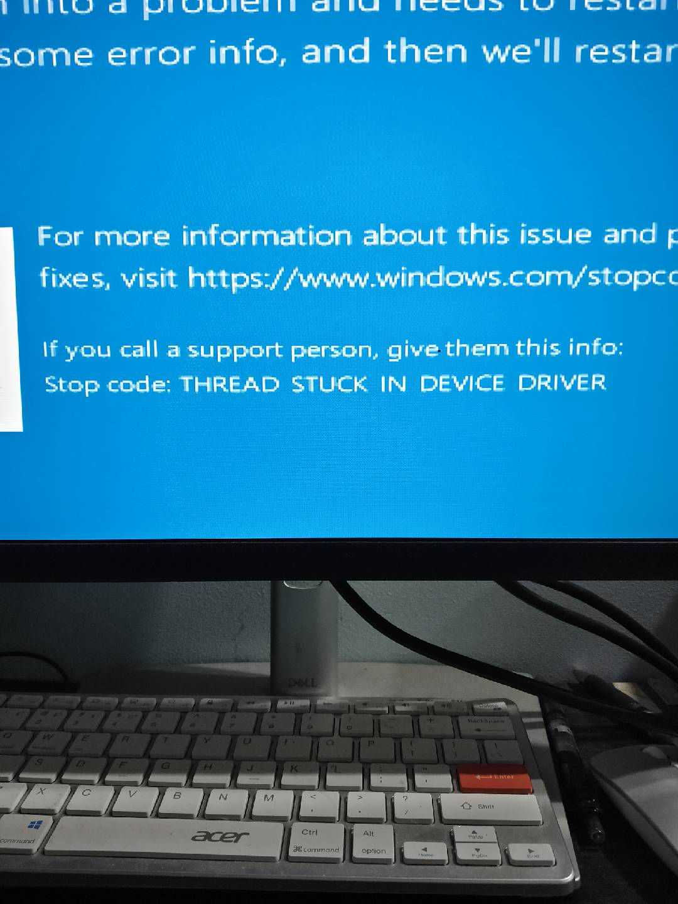

# 起因
不知道为什么突然蓝屏，重启后无论如何启动都是报错误， 无论重启或者恢复都不能解决问题。

# 分析
仔细想了一下蓝屏多半和驱动有关， 但是具体是哪个驱动导致的蓝屏， 我也没有办法确定。
1. 在安全模式下尝试卸载了显卡驱动，结果可以进入系统
2. 那么大概率和显卡驱动有关， 但是具体是哪个驱动导致的蓝屏， 我也没有办法确定。
3. 尝试用amd 官网下载的去东安装，同样蓝屏。

这个时候在不换系统的尝试都试过了，估摸着和系统更新有关，决定尝试重装一下系统。镜像来自 I tell you  这个网站。
重装好以后，还是只要一打不定就蓝屏 还是报上面错误

# 意外之喜
重装也解决不了问题，我已经怀疑我显卡坏了，突然网上说如果系统有问题可以换 win11, 因为我是e5 不能升级，那么我降级到win7总行了吧。
装完win7 , 让后打上win7 的显卡驱动居然一点问题都没有，真的是太棒。

# 无奈要装win10
win7 装完以后发现很多开发软件不支持win10, 所以想了一下是否再升级一下win10, 这次我用了官方升级工具去升win10, 并且备份了一下 win7 防止出现之前情况。
用这个链接进行升级：https://www.microsoft.com/en-us/software-download/windows10?msockid=373cec2838d96ae50ff8fa9b39f76b39

结果升级完居然一切都正常，说明我的显卡是没有问题的。

# 总结
1. 先不要觉得自己显卡坏了，尝试换个windows 版本打上驱动
2. 从官方下的镜像可能会更好，现在怀疑i tell you win10 的镜像可能存在不兼容的问题。