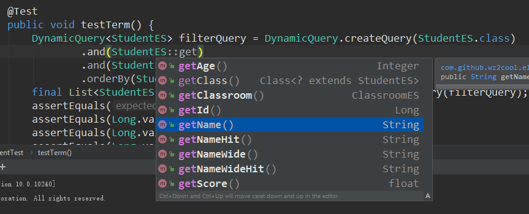
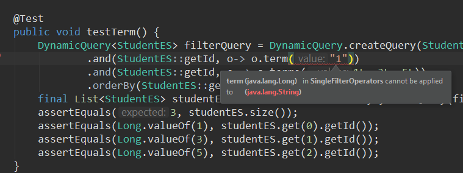
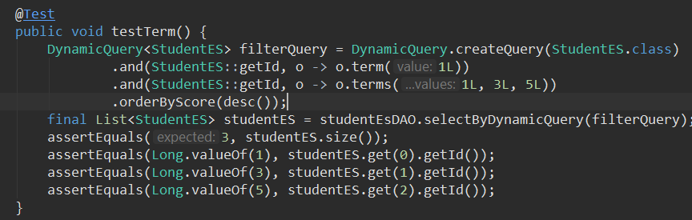
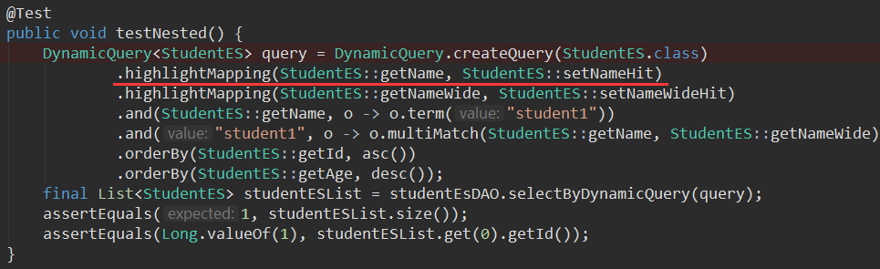
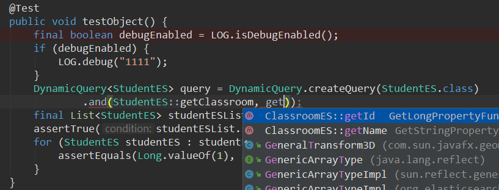
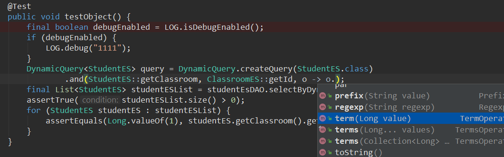

项目地址：https://github.com/wz2cool/elasticsearch-dynamic-query  
demo 地址： https://github.com/wz2cool/elasticsearch-dynamic-query-demo

# 简介

elasticsearch Dynamic Query 是对 spring data elasticsearch 的一个封装， 主要针对是对 elasticsearch 的查询。同样作为 mybatis dynamic query 的兄弟项目他们有着相似的 api 设计。

# 特性

## 智能提示

## 强类型报错

对于基础类型，能做到强类型报错  

## 评分排序

## 高亮映射

## 内嵌属性查询

## 智能提示操作

# 结束

后续会详细出教程如何更加便利的使用这套框架，大家可以先对着 demo 试用起来
