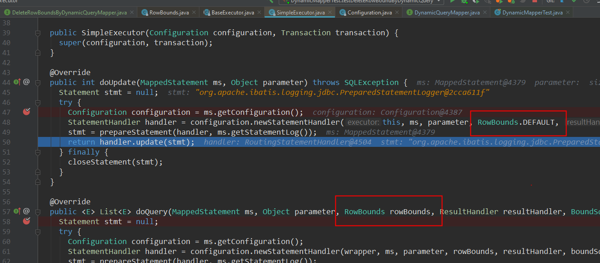

项目地址： [mybatis-dynamic-query](https://github.com/wz2cool/mybatis-dynamic-query)

# 更新内容

1. 自定义站位，针对@View 和 @Column 中的 Table
2. 添加 last 方法

## 自定义站位

在我们开发过程中往往需要动态注入一些变量就像 mybatis 中的 $ 或者 #，目前支持@View (以后可能支持@Column,目前没找到办法)

我们先下面例子就是可以动态在@View

```java
@View("${product_table} LEFT JOIN ${category_table} ON ${product_table}.category_id = ${category_table}.category_id")
public class DynamicProductView {

    @Column(name = "product_id", table = "product")
    private Long productID;
    @Column(name = "product_name", table = "product")
    private String productName;
    @Column(name = "price", table = "product")
    private BigDecimal price;

    @Column(name = "category_id", table = "category")
    private Long categoryID;
    @Column(name = "category_name", table = "category")
    private String categoryName;
    @Column(name = "description", table = "category")
    private String description;
    @Column(name = "description", table = "product")
    private String productDescription;
...
}
```

测试代码
```java
@Test
public void testDynamicProductView() {
    DynamicQuery<DynamicProductView> query = DynamicQuery.createQuery(DynamicProductView.class)
        .and(DynamicProductView::getCategoryID, o -> o.greaterThan(1L))
        // 去替换@View 中的站位的查询参数
        .queryParam("product_table", "product")
        .queryParam("category_table", "category");

    List<DynamicProductView> productViewList = dynamicProductViewMapper.selectByDynamicQuery(query);
    Assert.assertFalse(productViewList.isEmpty());
}

```

输出我们可以看到@View中的表名字都被替换了
```bash
==>  Preparing: SELECT product.product_id AS product_id, product.price AS price, category.description AS description, category.category_name AS category_name, product.product_name AS product_name, category.category_id AS category_id, product.description AS product_description FROM product LEFT JOIN category ON product.category_id = category.category_id WHERE (category.category_id > ?)
==> Parameters: 1(Long)
<==    Columns: PRODUCT_ID, PRICE, DESCRIPTION, CATEGORY_NAME, PRODUCT_NAME, CATEGORY_ID, PRODUCT_DESCRIPTION
<==        Row: 2, 9, test, Condiments, Northwind Traders Syrup, 2, p2
<==        Row: 3, 16, test, Condiments, Northwind Traders Cajun Seasoning, 2, p3
<==        Row: 4, 16, test, Oil, Northwind Traders Olive Oil, 3, p4
<==        Row: 5, 16, test, Oil, Northwind Traders xxxx Oil, 3, p5
<==      Total: 4
```

## last 方法
我们知道在mybatis中查询是可以用RowBound进行分页查询，但是我们发现在删除的时候是不好用limit的，这个是mybatis源代码决定他是不可以的，我们看一下源码delete 走的是doUpdate 方法，RowBound 是 default.


所以为了让Delete 支持这个行为 我们加上last方法 ，注意多次调用last 只会有最后一个last 生效
我们简单看一下demo

```java
@Test
public void testDeleteByDynamicQueryWithLimit() {
    User user = new User();
    user.setId(20);
    user.setUserName("frank20");
    user.setPassword("frank");

    User user2 = new User();
    user2.setId(21);
    user2.setUserName("frank21");
    user2.setPassword("frank");

    userDao.insert(user);
    userDao.insert(user2);

    DynamicQuery<User> query = DynamicQuery.createQuery(User.class)
            .and(User::getId, o -> o.greaterThanOrEqual(20));
    int count = userDao.selectCountByDynamicQuery(query);
    assertEquals(2, count);

    DynamicQuery<User> deleteQuery = DynamicQuery.createQuery(User.class)
            .and(User::getId, o -> o.greaterThanOrEqual(20))
            // 可以直接用.last("limit 1"), 如果想防注入可以这么写
            .last("limit #{number}")
            .queryParam("number", 1);
    int effectRow = userDao.deleteByDynamicQuery(deleteQuery);
    assertEquals(1, effectRow);
    count = userDao.selectCountByDynamicQuery(query);
    assertEquals(1, count);
}
```
我们看一下输出就可以看到 最后Delete有限制limit
```bash
JDBC Connection [HikariProxyConnection@198250778 wrapping conn0: url=jdbc:h2:mem:default user=SA] will not be managed by Spring
==>  Preparing: DELETE FROM users WHERE (id >= ?) limit ?
==> Parameters: 20(Integer), 1(Integer)
<==    Updates: 1
```

