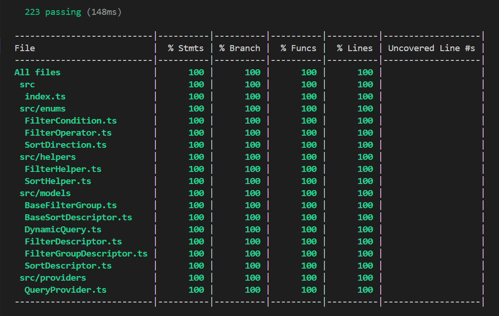
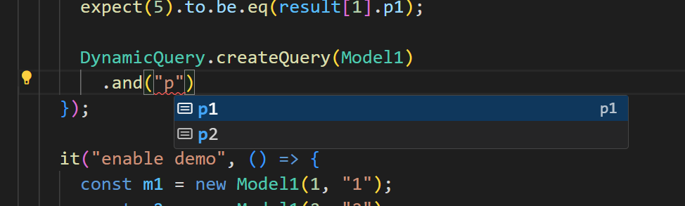
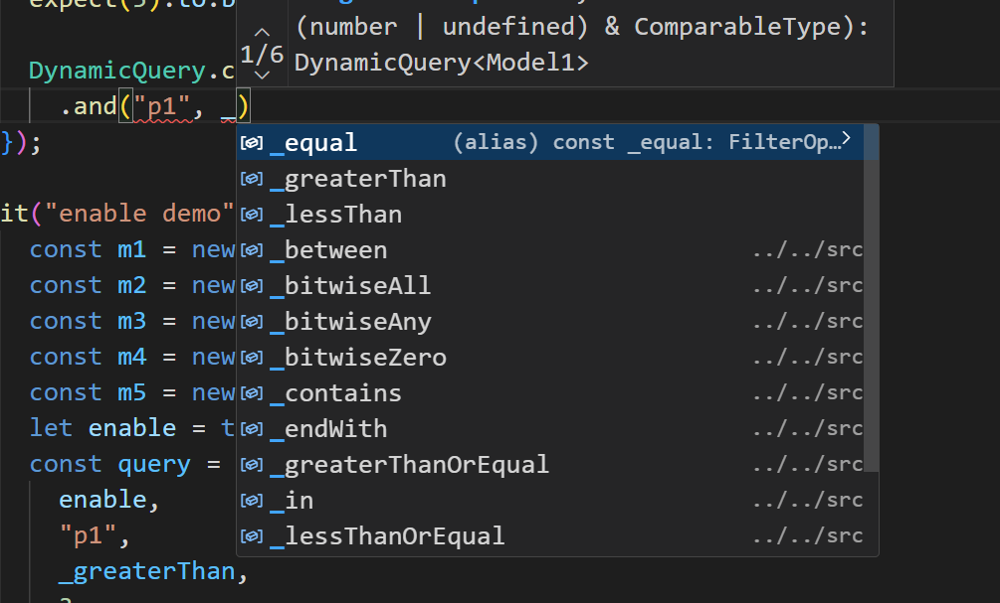
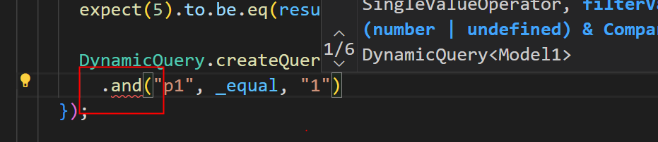
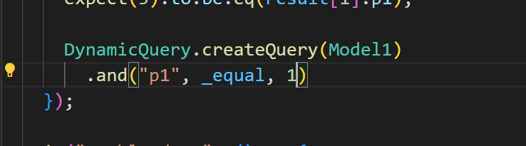

项目地址： [ts-dynamic-query](https://github.com/wz2cool/ts-dynamic-query)

# 前言

这次大版本升级可以让前端保持和 java 版本写法可以保持一致，前端也可以很方便用链式调用完成 DynamicQuery 构建, 这次改动有点大，但是这边尽量做到对以前语法兼容和 100% 代码覆盖率。


# 更新内容

## 链式调用

```ts
it("method Chaining", () => {
  const m1 = new Model1(1, "1");
  const m2 = new Model1(2, "2");
  const m3 = new Model1(3, "3");
  const m4 = new Model1(4, "4");
  const m5 = new Model1(5, "5");

  const query = DynamicQuery.createQuery(Model1)
    // 链式调用 > 1 & < 3
    .and("p1", _greaterThan, 1)
    .and("p1", _lessThan, 3);
  const result = query.query([m1, m2, m3, m4, m5]);

  expect(1).to.be.eq(result.length);
  const value1 = result[0];
  expect(2).to.be.eq(value1.p1);
  expect("2").to.be.eq(value1.p2);
});
```

## enable 是否启用筛选

只要 enable 是 false 对应的筛选条件将不会启用

```ts
it("enable demo", () => {
  const m1 = new Model1(1, "1");
  const m2 = new Model1(2, "2");
  const m3 = new Model1(3, "3");
  const m4 = new Model1(4, "4");
  const m5 = new Model1(5, "5");

  const query = DynamicQuery.createQuery(Model1)
    .and("p1", _greaterThan, 1)
    // 利用enable, 关闭小于限制
    .and(false, "p1", _lessThan, 3);
  const result = query.query([m1, m2, m3, m4, m5]);
  // 只过滤掉1
  expect(4).to.be.eq(result.length);
});
```

## 筛选组

```ts
it("group (>1 and < 3) or (= 5)", () => {
  const m1 = new Model1(1, "1");
  const m2 = new Model1(2, "2");
  const m3 = new Model1(3, "3");
  const m4 = new Model1(4, "4");
  const m5 = new Model1(5, "5");

  const query = DynamicQuery.createQuery(Model1)
    // 筛选组
    .and((g) => g.and("p1", _greaterThan, 1).and("p1", _lessThan, 3))
    .or("p1", _equal, 5);
  const result = query.query([m1, m2, m3, m4, m5]);
  expect(2).to.be.eq(result.length);
  expect(2).to.be.eq(result[0].p1);
  expect(5).to.be.eq(result[1].p1);
});
```

## 智能提示

无需在去记繁琐的属性


用下划线规避 例如\_in 操作符为保留字段


## 强类型校验

p1 为 number 类型，当筛选值为字符串报错

当筛选值为 1 不报错


# 最后

这次升级对前端，对于复杂查询无论从开发效率还是不容易出错上都有了很大的提升，欢迎大家使用，有问题随时可以反馈
